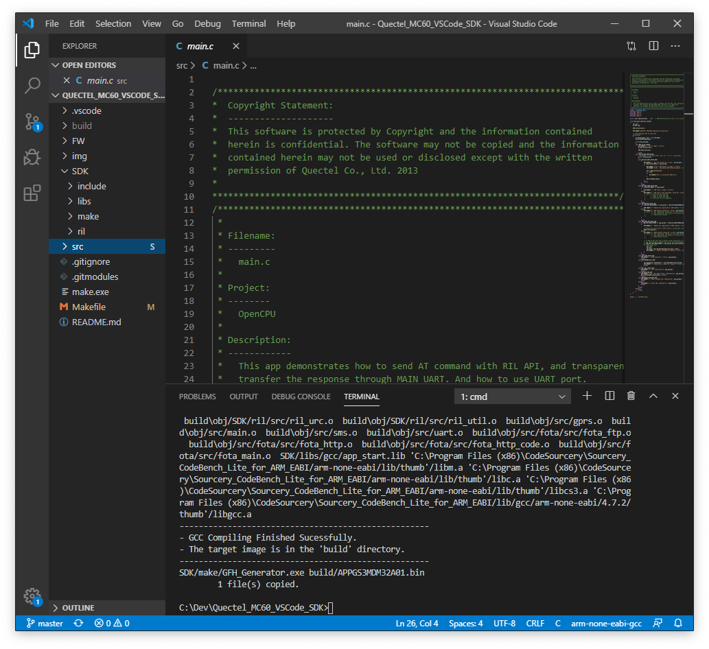
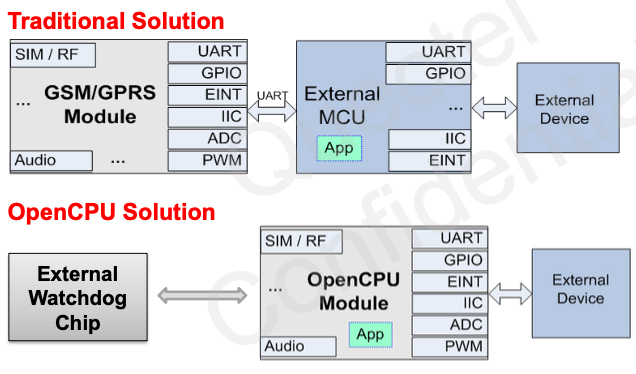

# Introduction

As VSCode is the most popular SDK for developer and original SDK from Quectel is not VSCode friendly, so I write this repository to produce better VSCode intergration for MC60 OpenCPU development. 

Following things are improved compared to official SDK:
- SDK folder: remove all tools, example folder that not needed for normal development
- Makefile: make clear Makefile script to include src files located at `src` folder.
- C language intelliSenseMode is configured



Advantage of OpenCPU approach is that: you can write application firmware just inside MC60 Module, instead of using external MCU, so total solution cost is reduced. 



For MC60 Example Code, pls refer to [Quectel_MC60_OpenCPU](https://github.com/ngohaibac/Quectel_MC60_OpenCPU) repo.

Current MC60 SDK: [MC60_OpenCPU_GS3_SDK_V1.7](http://www.quectel.com/ProductDownload/MC60_OpenCPU_GS3_SDK_V1.7.zip).

TODO:
- Add VSCode action context 
- Add burning script just inside VSCode

## MC60 Useful Information

Officially Quectel provides following documents, tools for MC60 OpenCPU development:

[MC60 Product info](https://www.quectel.com/product/MC60.htm): includes product specification, however you can't download documents without having registered account.   

[MC60 Documents and Tools](https://www.quectel.com/ProductDownload/MC60.html): included all needed documents like Software documents (AT Commands, and app notes), hardware documents (Reference design, footprint, ... )   

[MC60 OpenCPU SDK](https://www.quectel.com/ProductDownload/MC60_OpenCPU_SDK.html): OpenCPU documents, GCC compiler, SDK

You can read my blog post for more [Quectel IoT Modules Overview](https://bacnh.com/quectel-iot-product-overview/)

## Resource information

Processor: 32-bit ARM7EJ-STM RISC 260MHz.

MC60-OpenCPU (OC: MC60CA-04-STD) module builds in 4MB flash and 4MB RAM.
- User App Code Space: 320KB space available for image bin. 
- RAM Space: 100KB static memory and 500KB dynamic memory. 
- User File System Space: 120KB available.

## Prepare

I assump that VSCode is already installed in your machine.

1. Install [GCC Compiler](http://www.quectel.com/ProductDownload/GCC_Compiler_Setup.zip) with Administrator role and Windows 7 compability mode.
2. Flash the base FW: MC60CAR01A12 at [FW](/FW) folder
3. InstallMicrosoft [Visual C++ 2010 Redistributable Package (x86)](https://www.microsoft.com/en-us/download/details.aspx?id=5555) for image generation tool `GFH_Generator` to work.

## Usage

Clone this repo and its submodule and open with VSCode. Another method, you can just download the [zip file](https://github.com/ngohaibac/Quectel_MC60_VSCode_SDK/archive/MC60.zip)

```
$ git clone --recursive https://github.com/ngohaibac/Quectel_MC60_VSCode_SDK.git
$ cd Quectel_MC60_VSCode_SDK
$ code .
```

Folder structure:
```
├───.vscode
├───FW              <-- Base firmware folder
├───img
├───SDK             <-- SDK folder
│   ├───include     <-- SDK include header files
│   ├───libs        <-- Precompiled GCC library
│   │   └───gcc
│   ├───make        <-- FW pkg generation tool
│   └───ril         <-- RIL src, can adjust to fit your need
│       ├───inc
│       └───src
└───src
    ├───config
    └───fota
        ├───inc
        └───src
```

All development should be done inside `src` folder.
In the `cmd` terminal, you can just type `make` to build the images.
- To build fw: type `make` or select Terminal-->Run build task... (Ctr+Shift+B)
- To clean fw: `make clean`

*Note*: for this demo purpose, I just create submodule src that point to MC60 Example repository. You are free to link with your own src repository to build your application.

## How to upgrade SDK

Copy over folder `include`, `libs` and `ril` from Quectel SDK to this repo SDK folder.

## Technical support and copyright

I don't intend to create this repository to take over technical support from Quectel Wireless Solution. Thus, for particular technical support of MC60, pls goto respective Quectel FAE or Quectel forums.

All SDK files and documents are belong to Quectel Wireless Solution copyright. 

*Note*: If you are working with MC60-E, pls goto branch MC60-E.
